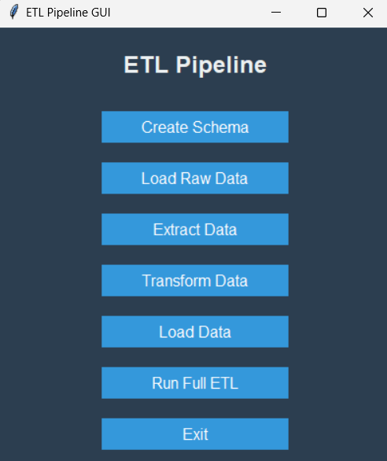

# openflights-ETL-Pipeline

## Overview
This project is a data pipeline designed to collect, process, and analyze airline and flight route data from the OpenFlights dataset. 
The goal is to clean, transform, and enrich this data to address key business questions in the airline industry, such as route optimization, environmental impact, and operational efficiency. The pipeline leverages PostgreSQL with geospatial capabilities (PostGIS) for efficient querying and data storage.
## 1. Features

This ETL pipeline includes the following components:

- **Data Ingestion**: Downloads relevant datasets (airports, airlines, routes) from the OpenFlights repository.
- **Data Storage**: Stores raw and processed data in PostgreSQL, optimized for geospatial queries using PostGIS.
- **Data Transformation**: Cleans, normalizes, and enriches data for efficient querying.
- **Data Enrichment**: Calculates distances for direct flights, identifies codeshare flights, and adds geographic metadata.
- **Data load**: Loads transformed data into a data warehouse schema in PostgreSQL to support complex analytical queries.
- **Data Querying**: Provides SQL queries to address specific business questions.
- **Business Intelligence**: Generates insights and recommendations on environmental impact, route efficiency, and new market opportunities.

---

## 2. Project Structure

The project consists of the following main directories and files:

1. **etl_scripts**
   - Contains scripts for extracting, transforming, and loading data.
   - Includes:
     - `extract.py`: Extracts data from sources.
     - `transform.py`: Cleans and transforms the data.
     - `load.py`: Loads data into the database.
     - `create_schema.sql`: Sets up database schema.
     - `etl.py`: run pipeline without GUI.
     - `etl_gui.py`: run pipeline with GUI.
     - `requirements.txt`: Lists Python dependencies.
     - `.env`: Configuration file for database credentials.

2. **raw_data_scripts**
   - Scripts specifically for loading raw data into the database.
   - Includes:
     - `load_raw_data.py`: Loads initial raw data into the database.
     - `requirements.txt`: Lists required dependencies for loading scripts.
     - `.env`: Configuration file with database connection details for raw data.

3. **Data**
   - Directory containing raw and transformed datasets.
   - Includes:
     - `raw_data`: Folder containing raw data in CSV format.
       - Contains three CSV files relevant to raw data.
     - `transformed_data`: Folder with transformed data in CSV format.
       - Contains three CSV files with processed data.

4. **analytics**
   - Contains analytics resources and documentation.
   - Includes:
     - `dashboard.pbix`: Power BI dashboard with data visualizations.
     - `bi_report.pdf`: Business Intelligence report with insights.
     - `queries.sql`: SQL file with data analysis queries.
     - `results.pdf`: PDF with summarized query results.
     - `etl_pipeline_documentation.pdf`: Detailed ETL pipeline documentation.
     - `demo.pdf`: Demo file including UI images of the dashboard, schema, and query examples.
     - `bi.sql`: SQL script for BI-related queries.
     - `queries.sql`: Additional SQL queries for analysis.

## 3. Prerequisites

Before running the pipeline, ensure that you have the following installed:

- **Python** (Version 3.6 or higher)
- **Required Libraries** (specified in `requirements.txt`)
- **PostgreSQL Database** (for storing and querying data)
- **Cloud Services or Local Environment** to run the pipeline

# Getting Started

1. **Clone the Repository**  
   Clone the project repository to your local environment.

   ```bash
   git clone https://github.com/mohamedelsayed10/openflights-ETL-Pipeline.git
2. **Navigate to the Appropriate Folder**
    ```bash
     cd etl_scripts

3. **Install Dependencies**
Once in the correct folder, install the necessary Python libraries listed in `requirements.txt`:

    ```bash
    pip install -r requirements.txt
4. ***Configuration***
Database Configuration: Edit the .env file in the root directory of the project. This file will store sensitive database credentials and configuration
    > **WARNING:**
    > Please you should edit this .env and create any db in PostgreSQL and add name of db in .ev file


5. **Run the ETL Pipeline**
    You can run the ETL pipeline either step by step or as a full process using the GUI:
    ```bash
    python etl_gui.py
    ```
    Without the GUI:
    ``` bash
    python etl.py
## 5. Output

1. **📊 Data Warehouse Schema**  
   

2. **🔧 ETL GUI**  
   

3. **📈 Simple Dashboard**  
   


